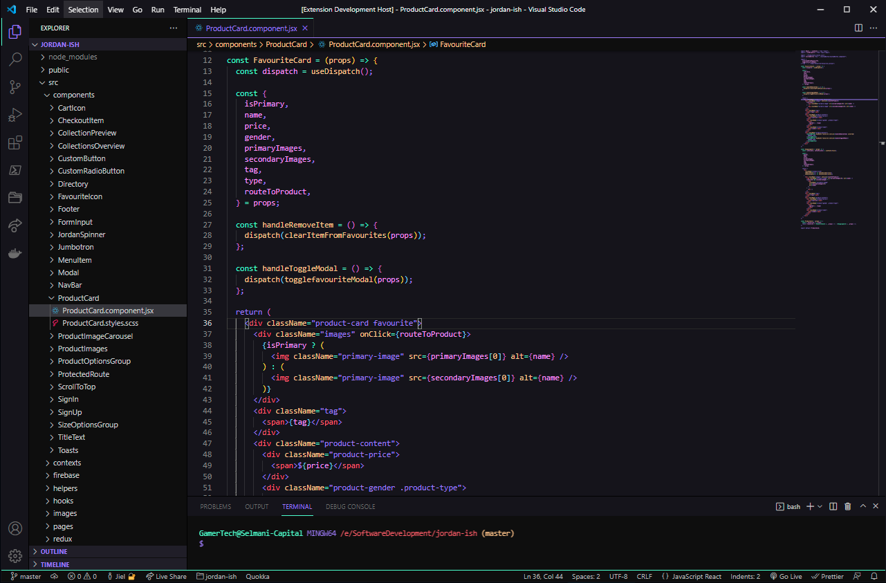

    

<h1 align="center">Cosmosis Theme</h1>

<em>Harnessing the Colours of the Cosmos, One Line of Code at a Time</em>

 

    

<h1>Installation</h1>  
<ol>
    <li>Open the <strong>Extensions</strong> sidebar in VS Code</li>
    <li>Search for Cosmosis Dark Theme</li>
    <li>Click <strong>Install</strong></li>
    <li>Open the <strong>Command Palette</strong></li>
    <li>Select <strong>Preferences: Color Theme</strong> and choose Cosmosis Dark</li>
    <li>Enjoy!</li>
</ol>
